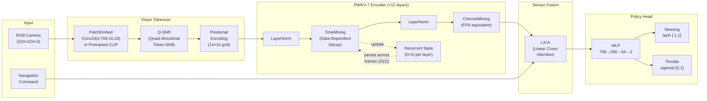
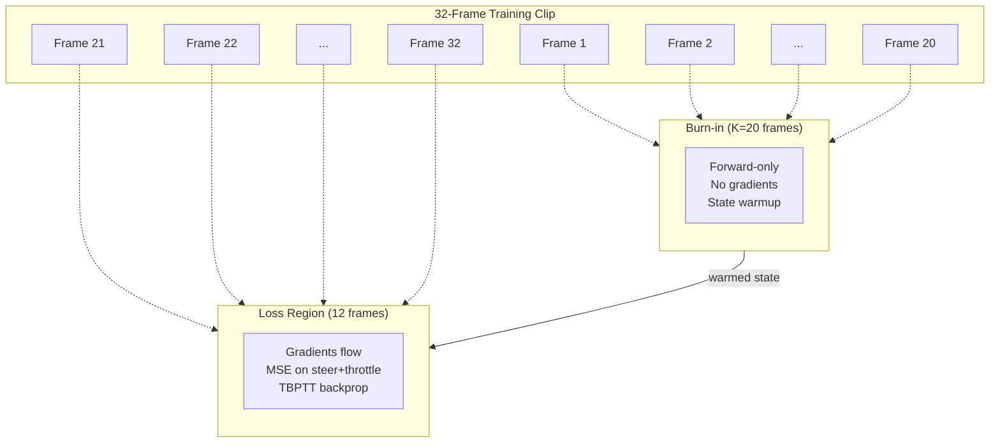
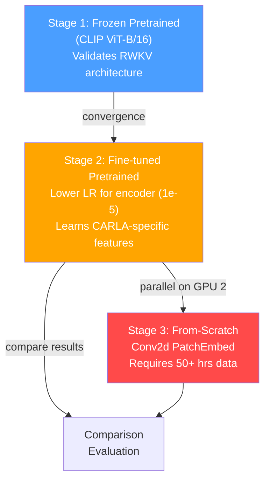

# Vision-RWKV Architecture Overview

## Full Pipeline (Inference Mode)

```mermaid
flowchart LR
    subgraph Input
        CAM["RGB Camera<br/>(224×224×3)"]
        NAV["Navigation<br/>Command"]
    end

    subgraph VisionTokenizer ["Vision Tokenizer"]
        PE["PatchEmbed<br/>Conv2d(3,768,16,16)<br/>or Pretrained CLIP"]
        QS["Q-Shift<br/>(Quad-directional<br/>Token Shift)"]
        POS["Positional<br/>Encoding<br/>(14×14 grid)"]
    end

    subgraph RWKVEncoder ["RWKV-7 Encoder (×12 layers)"]
        LN1["LayerNorm"]
        TM["TimeMixing<br/>(Data-Dependent<br/>Decay)"]
        LN2["LayerNorm"]
        CM["ChannelMixing<br/>(FFN equivalent)"]
        STATE["Recurrent State<br/>(D×D per layer)"]
    end

    subgraph Fusion ["Sensor Fusion"]
        LICA["LICA<br/>(Linear Cross-<br/>Attention)"]
    end

    subgraph PolicyHead ["Policy Head"]
        MLP["MLP<br/>768→256→64→2"]
        STEER["Steering<br/>tanh [-1,1]"]
        THROT["Throttle<br/>sigmoid [0,1]"]
    end

    CAM --> PE --> QS --> POS
    POS --> LN1 --> TM --> LN2 --> CM
    STATE -.->|"persist across<br/>frames (O(1))"| TM
    TM -.->|update| STATE
    CM --> LICA
    NAV --> LICA
    LICA --> MLP --> STEER & THROT
```

## Training Mode (TBPTT with Burn-in)

```mermaid
flowchart TB
    subgraph Episode ["32-Frame Training Clip"]
        direction LR
        B1["Frame 1"]
        B2["Frame 2"]
        B3["..."]
        B20["Frame 20"]
        T21["Frame 21"]
        T22["Frame 22"]
        T3["..."]
        T32["Frame 32"]
    end

    subgraph BurnIn ["Burn-in (K=20 frames)"]
        direction TB
        BI_DESC["Forward-only<br/>No gradients<br/>State warmup"]
    end

    subgraph LossRegion ["Loss Region (12 frames)"]
        direction TB
        LR_DESC["Gradients flow<br/>MSE on steer+throttle<br/>TBPTT backprop"]
    end

    B1 & B2 & B3 & B20 -.-> BurnIn
    T21 & T22 & T3 & T32 -.-> LossRegion
    BurnIn -->|"warmed state"| LossRegion
```

## Vision Tokenization Stages

```mermaid
flowchart TB
    S1["Stage 1: Frozen Pretrained<br/>(CLIP ViT-B/16)<br/>Validates RWKV architecture"]
    S2["Stage 2: Fine-tuned Pretrained<br/>Lower LR for encoder (1e-5)<br/>Learns CARLA-specific features"]
    S3["Stage 3: From-Scratch<br/>Conv2d PatchEmbed<br/>Requires 50+ hrs data"]

    S1 -->|"convergence"| S2
    S2 -->|"parallel on GPU 2"| S3
    S2 -->|"compare results"| EVAL["Comparison<br/>Evaluation"]
    S3 --> EVAL

    style S1 fill:#4a9eff,color:#fff
    style S2 fill:#ffa500,color:#fff
    style S3 fill:#ff4a4a,color:#fff
```
